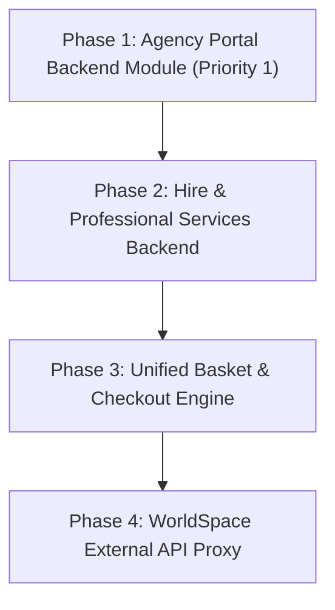
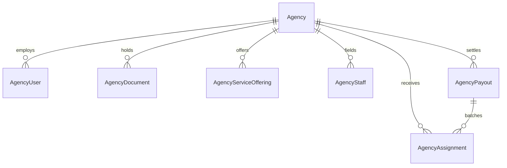

# Master Implementation Plan: World Portal Backend Services

* **Document Version:** 1.1.0
* **Date:** 2026-09-13
* **Author(s):** Raphael Etta / Antigravity AI
* **Status:** Active Roadmap & Tracker
* **Permanent Path:** [`worldPortal/docs/IMPLEMENTATION_PLAN_BACKEND.md`](file:///Users/ettaraphael/Documents/nest-app/worldportalv2/worldPortal/docs/IMPLEMENTATION_PLAN_BACKEND.md)

---

## 1. Executive Summary

Following recent frontend pulls, several major user-facing modules were added to `world-portal-frontend`:
- **Agency Portal (`/agency`)**: Agency listing wizard, dashboard overview, staff assignment, document uploads, and payout settlements.
- **Hire Module (`/hire`)**: Professional profiles, cards, bio modals, and hiring workflow.
- **WorldSpace (`/worldspace`)**: Social post feed components and mock API route.
- **Basket Checkout**: Cart drawer and booking package management.

Currently, these frontend modules use local mock data stores (e.g. `src/server/agency/store.ts`). This master implementation plan outlines the strategy, architecture, and step-by-step roadmap to implement production NestJS backend services and Prisma PostgreSQL schemas in `worldPortal`.

---

## 2. Technical Roadmap & Phase Breakdown



---

## 3. Master Progress Checklist

### Phase 1: Agency Portal Backend Module (Priority 1)
- [x] **1.1 Architecture & ADR Documentation**
  - [x] Draft Technical Architecture Decision Record ([`0008-agency-portal-backend-architecture.md`](file:///Users/ettaraphael/Documents/nest-app/worldportalv2/worldPortal/docs/adr/0008-agency-portal-backend-architecture.md))
  - [x] Draft ADR for Dummies ([`0008-agency-portal-backend-architecture.dummies.md`](file:///Users/ettaraphael/Documents/nest-app/worldportalv2/worldPortal/docs/adr/0008-agency-portal-backend-architecture.dummies.md))
  - [x] Index ADR 0008 in [`docs/adr/README.md`](file:///Users/ettaraphael/Documents/nest-app/worldportalv2/worldPortal/docs/adr/README.md)
- [x] **1.2 Database Schema & Prisma Client**
  - [x] Add Agency Enums & Relational Models (`Agency`, `AgencyUser`, `AgencyDocument`, `AgencyServiceOffering`, `AgencyStaff`, `AgencyAssignment`, `AgencyPayout`) to [`schema.prisma`](file:///Users/ettaraphael/Documents/nest-app/worldportalv2/worldPortal/prisma/schema.prisma)
  - [x] Run `npx prisma validate` and `npx prisma generate`
- [ ] **1.3 DTOs & Validation Schemas (`worldPortal/src/agency/dto/`)**
  - [x] `CreateAgencyDto`
  - [ ] `UpdateAgencyListingDto`
  - [ ] `AddAgencyStaffDto` / `UpdateAgencyStaffDto`
  - [ ] `UploadAgencyDocumentDto`
  - [ ] `AssignStaffDto`
  - [ ] `AgencyAuthDto` (Login / Registration)
- [ ] **1.4 NestJS Business Logic Layer (`worldPortal/src/agency/agency.service.ts`)**
  - [ ] Auth & Session Management (Login, Tenant context lookup)
  - [ ] Listing Management (Save draft, update categories, submit for review)
  - [ ] Compliance & Verification Document Operations (Upload, status change)
  - [ ] Staff Roster Operations (Add staff, toggle availability, assign to booking)
  - [ ] Assignment & Booking Management (Query active bookings, compute fees)
  - [ ] Financial Payout Calculations & Settlement Batches
  - [ ] Overview Headline Statistics Calculator
- [ ] **1.5 NestJS REST Controller (`worldPortal/src/agency/agency.controller.ts`)**
  - [ ] `POST /api/agency/auth/login` & `GET /api/agency/me`
  - [ ] `GET /api/agency/overview`
  - [ ] `GET /api/agency/listing` & `PATCH /api/agency/listing`
  - [ ] `GET /api/agency/documents` & `POST /api/agency/documents`
  - [ ] `GET /api/agency/staff`, `POST /api/agency/staff`, `PATCH /api/agency/staff/:id`
  - [ ] `GET /api/agency/assignments` & `POST /api/agency/assignments/:id/assign`
  - [ ] `GET /api/agency/payouts`
- [ ] **1.6 Module Integration (`worldPortal/src/app.module.ts`)**
  - [ ] Register `AgencyModule` in `app.module.ts`
- [ ] **1.7 Automated Test Coverage**
  - [ ] Unit tests for `AgencyService` (`agency.service.spec.ts`)
  - [ ] E2E tests for `AgencyController` (`agency.controller.spec.ts`)
- [ ] **1.8 Frontend Data Seam Connection (`src/server/agency/store.ts`)**
  - [ ] Replace in-memory array operations with `fetch()` calls to NestJS `/api/agency/*` endpoints

---

### Phase 2: Hire & Professional Services Backend Module
- [ ] **2.1 Prisma Schema Extension**
  - [ ] Add `ProfessionalProfile`, `HireBooking`, and `ProfessionalRating` models to `schema.prisma`
- [ ] **2.2 NestJS `HireModule` Implementation (`worldPortal/src/hire/`)**
  - [ ] Create DTOs (`QueryProfessionalsDto`, `CreateHireBookingDto`)
  - [ ] Create `HireService` for searching professionals, calculating rates, and handling booking requests
  - [ ] Create `HireController` with endpoints (`GET /api/hire/professionals`, `GET /api/hire/professionals/:id`, `POST /api/hire/bookings`)
- [ ] **2.3 Module Registration & Testing**
  - [ ] Register `HireModule` in `app.module.ts`
  - [ ] Unit & E2E tests
- [ ] **2.4 Frontend Integration**
  - [ ] Connect `src/features/hire/` components and API routes to backend endpoints

---

### Phase 3: Unified Basket & Booking Checkout Engine
- [ ] **3.1 Payment System Extension (`worldPortal/src/payment/`)**
  - [ ] Update `PaymentTransaction` model to accept package items (Visa + Agency Services + Professional Hire)
  - [ ] Add multi-item fee breakdown logic in `PaymentService`
- [ ] **3.2 Frontend Cart Seam Cutover**
  - [ ] Connect Zustand basket store (`src/features/basket/store.ts`) to backend checkout API

---

### Phase 4: WorldSpace External API Proxy Integration
- [ ] **4.1 External Service Configuration**
  - [ ] Add `WORLDSPACE_API_URL` and authentication tokens to backend `.env`
- [ ] **4.2 Client Seam Update**
  - [ ] Update `src/server/worldspace/client.ts` to fetch and validate live feeds via Zod schema

---

## 4. Data Schema & Domain Models (Phase 1 Detail)

### Enums
- `AgencyVerificationStatus`: `UNVERIFIED`, `PENDING`, `VERIFIED`, `SUSPENDED`
- `AgencyListingStatus`: `DRAFT`, `SUBMITTED`, `IN_REVIEW`, `LIVE`, `REJECTED`, `PAUSED`
- `AgencyUserRole`: `OWNER`, `MANAGER`, `COORDINATOR`
- `AgencyStaffStatus`: `AVAILABLE`, `ASSIGNED`, `OFF_DUTY`, `INACTIVE`
- `AssignmentStatus`: `REQUESTED`, `ASSIGNED`, `IN_PROGRESS`, `COMPLETED`, `CANCELLED`
- `AgencyPayoutStatus`: `PENDING`, `PROCESSING`, `PAID`, `ON_HOLD`

### Key Models Relationship


---

## 5. Verification & Testing Strategy

1. **Prisma Validation:**
   ```bash
   cd worldPortal && npx prisma validate && npx prisma generate
   ```
2. **NestJS Automated Unit & E2E Testing:**
   ```bash
   cd worldPortal && npm run test
   ```
3. **Integration Verification:**
   Verify frontend `/agency` routes connect to `http://localhost:3001/api/agency/*` seamlessly.
